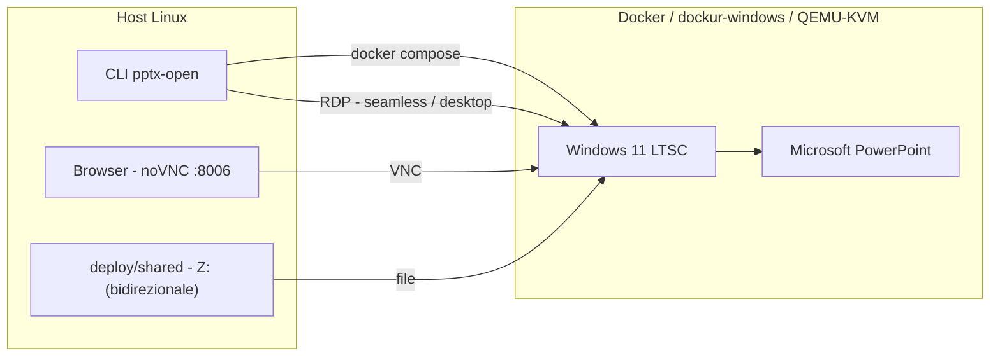

# pptx-open

[English](README.md) · **Italiano**

> Apre file `.pptx` con **Microsoft PowerPoint reale** su Linux — stesso
> motore, stessi font, stesso rendering di Windows — dentro una VM Windows
> disposable. Niente Wine, niente LibreOffice, nessun compromesso sulla
> fedeltà.


---

## Indice

- [Perché PowerPoint vero (e non Wine)](#perché-powerpoint-vero-e-non-wine)
- [Come funziona](#come-funziona)
- [Requisiti](#requisiti)
- [Avvio rapido](#avvio-rapido)
- [Uso](#uso)
- [Configurazione](#configurazione)
- [Licenze e attivazione](#licenze-e-attivazione)
- [Gate di fedeltà](#gate-di-fedeltà)
- [Struttura del progetto](#struttura-del-progetto)
- [Stato e roadmap](#stato-e-roadmap)
- [Documentazione](#documentazione)
- [Ispirato da e costruito con](#ispirato-da-e-costruito-con)
- [Licenza](#licenza)

## Perché PowerPoint vero (e non Wine)

Office sotto Wine è storicamente instabile: si rompe a ogni aggiornamento
Click-to-Run, e le parti che contano di più per la fedeltà — SmartArt,
animazioni, transizioni, font substitution — sono proprio i punti deboli del
layer emulato GDI/Direct2D/DirectWrite. Non esiste un'immagine pubblica
"Wine + Office 365" mantenuta.

Questo progetto prende la strada noiosa e affidabile: **una VM Windows vera, con
Office vero**, dentro un container e pilotata da Linux. La fedeltà non è
emulata: è ereditata.

## Come funziona

`dockur/windows` esegue Windows 11 LTSC in QEMU/KVM dentro un container Docker.
Office viene installato automaticamente con l'Office Deployment Tool (ODT)
ufficiale di Microsoft. Per default il wrapper lancia PowerPoint come finestra
**seamless** via RDP RemoteApp e apre il file sul posto tramite un drive
reindirizzato, quindi il salvataggio finisce direttamente sull'host. Sono
disponibili anche un desktop RDP completo (`--desktop`) e una modalità
web-VNC (`--vnc`, file scambiati tramite la cartella condivisa `Z:\`).



Tutto si configura da un unico file locale, `deploy/.env` (ignorato da git):
credenziali, risorse, rete e licenze. Nessun segreto viene mai committato.

## Requisiti

- Linux con KVM (`/dev/kvm` presente e scrivibile)
- Docker (o Docker Desktop / Podman con supporto KVM)
- ~8 GB di RAM e ~40 GB di disco libero
- Un trial Microsoft 365 **oppure** una product key per attivare Office (vedi sotto)

## Avvio rapido

```bash
git clone https://github.com/dexRand/365alFly.git
cd 365alFly

# prerequisiti host (Arch / CachyOS)
sudo pacman -S --needed docker
sudo systemctl enable --now docker
sudo usermod -aG docker "$USER"        # poi logout e nuovo login

# bootstrap e avvio
scripts/pptx-deploy.sh init            # crea deploy/.env con password casuale
scripts/pptx-deploy.sh up              # primo avvio: ~30–60 min (scarica Windows + Office)
scripts/pptx-deploy.sh url             # apri l'URL stampato nel browser
```

> Su Debian/Ubuntu il pacchetto del motore è `docker.io`. Su altre distro
> installa `docker` + il plugin Compose.

Il primo `up` scarica la ISO Windows (~4,7 GB) e installa Office dal CDN di
Microsoft (~2 GB). È un costo una tantum: il sistema installato vive in un
volume Docker e dopo riparte dal disco.

## Uso

### GUI (web-VNC)

Apri **<http://127.0.0.1:8006/>** — ottieni il desktop di Windows. Avvia
PowerPoint dal menu Start e lavora normalmente. La UI è in ascolto solo su
loopback e per default non chiede login (`WEB_PROTECT=N`).

### Riga di comando

```bash
# una volta: metti il wrapper nel PATH
ln -s "$PWD/wrapper/pptx-open" ~/.local/bin/pptx-open

pptx-open presentazione.pptx   # finestra PowerPoint seamless, file modificato sul posto
pptx-open --desktop deck.pptx  # desktop Windows completo via RDP
pptx-open --vnc deck.pptx      # modalità web-VNC, risincronizza il file salvato
pptx-open --kill deck.pptx     # apre, e a fine sessione spegne la VM
pptx-open --status             # stato VM + cartella condivisa
```

### Scambio file

Metti qualsiasi file in `deploy/shared/` e lo trovi in Windows sotto **`Z:\`**
(e nella cartella **Shared** sul desktop). Le modifiche fatte in Office tornano
nella stessa cartella: è bidirezionale.

## Configurazione

Tutto sta in `deploy/.env` (creato da `init`, ignorato da git, `chmod 600`).

| Variabile | Scopo |
|---|---|
| `VM_USER` / `VM_PASSWORD` | account Windows, usato da VNC e RDP |
| `WINDOWS_KEY` | product key Windows (opzionale) |
| `OFFICE_EDITION` | `auto` \| `ltsc2024` \| `ltsc2021` \| `2019` \| `o365` |
| `OFFICE_KEY` | product key Office (25 caratteri) |
| `OFFICE_LANGUAGE`, `OFFICE_EXCLUDE` | lingua / app Office da non installare |
| `WINDOWS_VERSION`, `VM_RAM`, `VM_CPU`, `VM_DISK` | risorse VM |
| `BIND_ADDR`, `WEB_PORT`, `RDP_PORT`, `VNC_PORT`, `WEB_PROTECT` | rete |
| `SHARED_DIR` | cartella condivisa con la VM (`Z:\`) |

Modifica il file e rilancia `scripts/pptx-deploy.sh up` per applicare.

## Licenze e attivazione

Questo progetto **non include né automatizza alcun tool di pirateria** (niente
MAS, niente emulatore KMS). L'attivazione segue i meccanismi di Microsoft:

- **Product key** — metti `OFFICE_KEY=xxxxx-xxxxx-xxxxx-xxxxx-xxxxx` in
  `deploy/.env`; `OFFICE_EDITION=auto` installa **Office LTSC 2024 (Volume)** e
  lo attiva da solo. Nessun account Microsoft richiesto.
- **Trial Microsoft 365** — senza key viene installato `o365`; fai il sign-in
  una volta nella VM per avviare il mese di prova.
- **Non attivato** — Office apre e renderizza comunque i `.pptx` (in sola
  lettura dopo il periodo di grazia), sufficiente per il gate di fedeltà.

Il prompt automatico "Sign in to set up Office" viene chiuso da un piccolo
watcher (`deploy/oem/nagkiller.vbs`) così un'installazione pulita ti porta
dritto in PowerPoint. È comodità di UI, **non** attivazione.

## Gate di fedeltà

Una funzionalità **non** è fatta quando "PowerPoint si apre": è fatta quando il
rendering è indistinguibile da PowerPoint su Windows. La suite renderizza 13
deck difficili dalla VM e li confronta pixel-per-pixel con i reference nativi:

> **21 / 25 slide byte-identiche**; le 4 rimanenti differiscono solo per
> antialiasing del testo (nessuna differenza di layout, geometria o contenuto).
> Verdetto: [`docs/TEST_MATRIX.md`](docs/TEST_MATRIX.md).

## Struttura del progetto

```
deploy/                 compose + .env + provisioning OEM (dockur/windows)
scripts/pptx-deploy.sh  CLI ambiente: init / doctor / office-config / up / down / reset
scripts/lib/            helper condivisi (parser .env sicuro)
wrapper/pptx-open       apre un .pptx in PowerPoint reale (seamless RDP / desktop / VNC)
wrapper/vm/             helper dentro la VM (open-file.bat)
tests/ + wrapper/tests/ suite di test bats
winapps-baseline/       deck di test, PNG di riferimento nativi, font
docs/                   guida deploy, guida wrapper, TEST_MATRIX, ADR
```

## Stato e roadmap

| Area | Stato |
|---|---|
| Ambiente Windows + Office (container, VNC/RDP) | ✅ funzionante |
| Provisioning automatico (trusted folder, sessione, Office, prompt killer) | ✅ funzionante |
| Gate di fedeltà (13 deck / 25 slide) | ✅ 21 byte-identiche, 4 solo AA |
| Wrapper CLI `pptx-open` | ✅ seamless RDP (default) + desktop + VNC, 34 test verdi |
| Seamless RAIL (FreeRDP RemoteApp) | ✅ implementato (modalità default) |
| CI (shellcheck + bats) | ✅ workflow committato (`.github/workflows/ci.yml`) |
| Esplorazione Wine | 💤 opzionale, non intrapresa |

## Documentazione

- [`docs/deploy.md`](docs/deploy.md) — guida ambiente e configurazione
- [`docs/wrapper.md`](docs/wrapper.md) — contratto e meccanismo della CLI
- [`docs/TEST_MATRIX.md`](docs/TEST_MATRIX.md) — matrice di fedeltà e verdetto
- [`docs/adr/`](docs/adr) — decisioni architetturali
- [`docs/winapps-manual.md`](docs/winapps-manual.md) — note storiche WinApps/RAIL
- [`AGENT_PLAN.md`](AGENT_PLAN.md) · [`tasks/`](tasks) — roadmap e task

## Ispirato da e costruito con

Questo progetto sta sulle spalle di altri. In ordine di importanza:

| Progetto | Cosa ne abbiamo preso |
|---|---|
| [**dockur/windows**](https://github.com/dockur/windows) | Il container Windows-in-Docker (QEMU/KVM) che è il nostro backend, e l'aggancio di provisioning OEM/`install.bat`. |
| [**WinApps**](https://github.com/winapps-org/winapps) | L'idea di eseguire applicazioni Windows *vere* su Linux via FreeRDP; la nostra baseline di Fase 1 e la roadmap seamless. |
| [**qemus/qemu**](https://github.com/qemus/qemu) | Il layer QEMU-in-Docker su cui si appoggia `dockur/windows`. |
| [**FreeRDP**](https://github.com/FreeRDP/FreeRDP) | Il client RDP usato per l'integrazione seamless RemoteApp e per l'accesso desktop completo. |
| [**noVNC**](https://github.com/novnc/noVNC) | Il visualizzatore VNC web servito sulla porta 8006. |
| [**Microsoft Office Deployment Tool**](https://learn.microsoft.com/microsoft-365-apps/deploy/office-deployment-tool-configuration-options) | Il modo ufficiale e supportato per installare Office in modo automatico. |

**Volutamente non usati**, perché non raggiungono la soglia di fedeltà: Wine,
LibreOffice, OnlyOffice. **Progetti correlati** utili se vuoi l'integrazione
completa del desktop: [WinBoat](https://winboat.app) e
[WinPodX](https://www.winpodx.org).

Tutti i nomi, i loghi e i marchi sono dei rispettivi proprietari. Questo
progetto non è affiliato a Microsoft.

## Licenza

[MIT](LICENSE).
