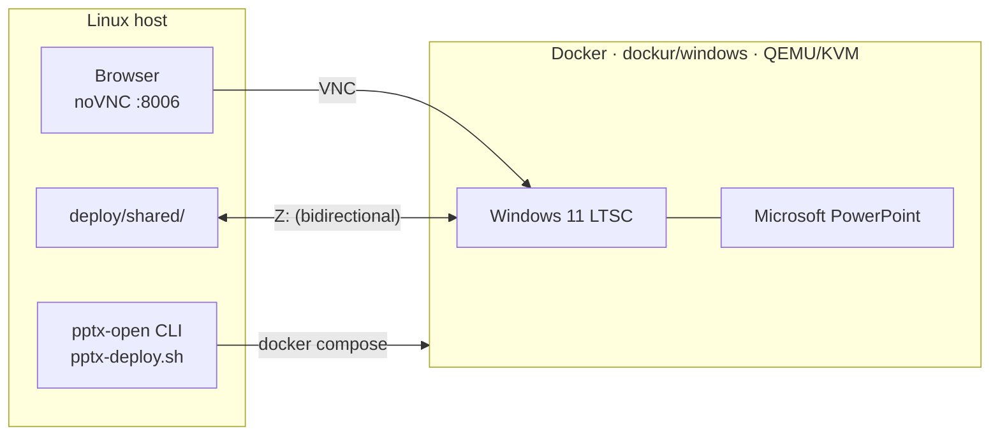

# pptx-open

**English** · [Italiano](README.it.md)

> Open `.pptx` files with **real Microsoft PowerPoint** on Linux — the same
> engine, the same fonts, the same rendering as Windows — inside a disposable
> Windows VM. No Wine, no LibreOffice, no fidelity compromise.


```console
$ pptx-open presentazione.pptx
```

---

## Why real PowerPoint (and not Wine)

Office under Wine is historically unstable: it breaks on every Click-to-Run
update, and the parts that matter most for fidelity — SmartArt, animations,
transitions, font substitution — are exactly the weak spots of the emulated
GDI/Direct2D/DirectWrite layer. There is no maintained public
"Wine + Office 365" image.

This project takes the boring, reliable route: **a real Windows VM, running
real Office**, kept in a container and driven from Linux. Rendering fidelity is
not emulated — it is inherited.

## How it works

`dockur/windows` runs Windows 11 LTSC in QEMU/KVM inside a Docker container.
Office is installed automatically with Microsoft's official Office Deployment
Tool (ODT). You reach the desktop over web-VNC (or RDP), and files move
bidirectionally through a shared folder exposed as `Z:\` in Windows.



Everything is configured from a single local file, `deploy/.env`
(git-ignored): credentials, resources, network and licenses. No secrets are
ever committed.

## Requirements

- Linux with KVM (`/dev/kvm` present and writable)
- Docker (or Docker Desktop / Podman with KVM support)
- ~8 GB RAM and ~40 GB free disk
- A Microsoft 365 trial **or** a product key for Office activation (see below)

## Quick start

```bash
git clone https://github.com/dexRand/365alFly.git
cd 365alFly

# host prerequisites (Arch / CachyOS)
sudo pacman -S --needed docker
sudo systemctl enable --now docker
sudo usermod -aG docker "$USER"        # then log out and back in

# bootstrap and start
scripts/pptx-deploy.sh init            # creates deploy/.env with a random password
scripts/pptx-deploy.sh up              # first run: ~30–60 min (downloads Windows + Office)
scripts/pptx-deploy.sh url             # open the printed URL in your browser
```

> On Debian/Ubuntu the engine package is `docker.io`. On other distros install
> `docker` + the Compose plugin.

The first `up` downloads the Windows ISO (~4.7 GB) and installs Office from
Microsoft's CDN (~2 GB). It is a one-time cost: the installed system lives in a
Docker volume and boots from disk afterwards.

## Usage

### GUI (web-VNC)

Open **<http://127.0.0.1:8006/>** — you get the Windows desktop. Launch
PowerPoint from the Start menu and work normally. The UI is bound to loopback
and needs no login by default (`WEB_PROTECT=N`).

### Command line

```bash
# once: put the wrapper on your PATH
ln -s "$PWD/wrapper/pptx-open" ~/.local/bin/pptx-open

pptx-open presentazione.pptx   # opens it in the VM, waits, syncs the saved file back
pptx-open --no-wait deck.pptx  # just open
pptx-open --kill deck.pptx     # open, then stop the VM when done
pptx-open --status             # VM state + shared folder
```

### Exchanging files

Drop anything into `deploy/shared/` and it appears in Windows under **`Z:\`**
(and the **Shared** desktop folder). Changes made in Office are written back to
the same folder — it is bidirectional.

## Configuration (`deploy/.env`)

| Variable | Purpose |
|---|---|
| `VM_USER` / `VM_PASSWORD` | Windows account, used by VNC and RDP |
| `WINDOWS_KEY` | Windows product key (optional) |
| `OFFICE_EDITION` | `auto` \| `ltsc2024` \| `ltsc2021` \| `2019` \| `o365` |
| `OFFICE_KEY` | Office product key (25 chars) |
| `OFFICE_LANGUAGE`, `OFFICE_EXCLUDE` | Office language / apps to skip |
| `WINDOWS_VERSION`, `VM_RAM`, `VM_CPU`, `VM_DISK` | VM resources |
| `BIND_ADDR`, `WEB_PORT`, `RDP_PORT`, `VNC_PORT`, `WEB_PROTECT` | networking |
| `SHARED_DIR` | folder shared with the VM (`Z:\`) |

Edit `deploy/.env` and re-run `scripts/pptx-deploy.sh up` to apply.

## Licensing & activation

This project **does not ship or automate any piracy tool** (no MAS, no KMS
emulator). Activation follows Microsoft's own mechanisms:

- **Product key** — put `OFFICE_KEY=xxxxx-xxxxx-xxxxx-xxxxx-xxxxx` in
  `deploy/.env`; `OFFICE_EDITION=auto` then installs **Office LTSC 2024
  (Volume)** and activates it automatically. No Microsoft account required.
- **Microsoft 365 trial** — with no key, `o365` is installed; sign in once in
  the VM to start the trial.
- **Unactivated** — Office still opens and renders `.pptx` files (read-only
  after the grace period), which is enough for the fidelity gate.

The unattended "Sign in to set up Office" prompt is auto-dismissed by a small
watcher (`deploy/oem/nagkiller.vbs`) so a fresh install drops you straight into
PowerPoint. That is UI convenience, **not** activation.

## Fidelity gate

A feature is **not** done when "PowerPoint opens" — it is done when the
rendering is indistinguishable from PowerPoint on Windows. The test suite
renders 13 tricky decks from the VM and compares them pixel-by-pixel against
native references:

> **21 / 25 slides byte-identical**; the remaining 4 differ only in text
> anti-aliasing (no layout, geometry or content differences).
> Verdict: [`docs/TEST_MATRIX.md`](docs/TEST_MATRIX.md).

## Project structure

```
deploy/                 compose + .env + OEM provisioning (dockur/windows)
scripts/pptx-deploy.sh  environment CLI: init / doctor / office-config / up / down / reset
scripts/lib/            shared helpers (safe .env parser)
wrapper/pptx-open       open / wait / sync a .pptx (VNC + shared folder)
wrapper/vm/             in-VM helper (open-file.bat)
tests/ + wrapper/tests/ bats test suites
winapps-baseline/       test decks, native reference PNGs, fonts
docs/                   deploy guide, wrapper guide, TEST_MATRIX, ADRs
```

## Status & roadmap

| Area | Status |
|---|---|
| Windows + Office environment (container, VNC/RDP) | ✅ working |
| Auto-provisioning (trusted folder, session, Office, prompt killer) | ✅ working |
| Fidelity gate (13 decks / 25 slides) | ✅ 21 byte-identical, 4 AA-only |
| `pptx-open` CLI wrapper | ✅ implemented, 33 tests green |
| Seamless RAIL integration (FreeRDP RemoteApp) | ⏳ planned |
| CI (shellcheck + bats) | ⏳ planned |
| Wine exploration | 💤 optional, not pursued |

## Documentation

- [`docs/deploy.md`](docs/deploy.md) — environment guide & configuration
- [`docs/wrapper.md`](docs/wrapper.md) — `pptx-open` CLI contract & mechanism
- [`docs/TEST_MATRIX.md`](docs/TEST_MATRIX.md) — fidelity matrix & verdict
- [`docs/adr/`](docs/adr) — architecture decisions
- [`docs/winapps-manual.md`](docs/winapps-manual.md) — historical WinApps/RAIL notes
- [`AGENT_PLAN.md`](AGENT_PLAN.md) · [`tasks/`](tasks) — roadmap and task tracking

## Credits

Built on [`dockur/windows`](https://github.com/dockur/windows) (Windows in
Docker), inspired by [WinApps](https://github.com/winapps-org/winapps), and
using Microsoft's official [Office Deployment Tool](https://learn.microsoft.com/microsoft-365-apps/deploy/office-deployment-tool-configuration-options).
All product names and trademarks are property of their respective owners; this
project is not affiliated with Microsoft.

## License

[MIT](LICENSE).
